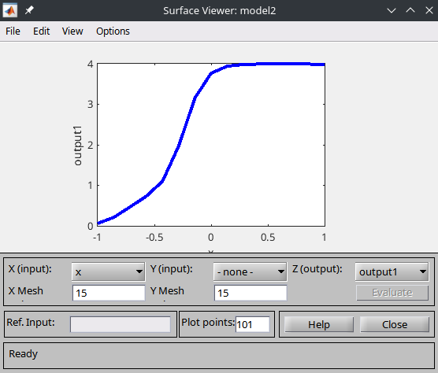
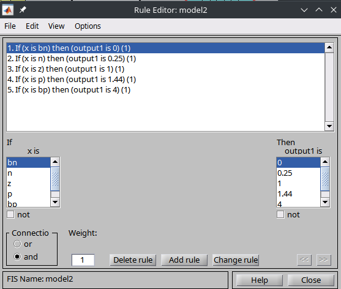

# Пример использования трапецевидной функции принадлежности в реальной ситуации:

Представим, что у вас есть система умного освещения в кафе. Целью системы является регулировка уровня освещения в зависимости от времени суток. Сигмоидная функция принадлежности может использоваться для моделирования этого процесса.

Например, используя трапецевидную функцию, можно определить, что с 18:00 до 23:00 (пиковые часы кафе) освещение должно быть на максимальном уровне. Значения функции принадлежности в этот временной диапазон будут стремиться к 1, что означает полную интенсивность света. Вне этих часов значение функции принадлежности постепенно снижается, сигнализируя о необходимости уменьшить интенсивность освещения.

Таким образом, трапецевидная функция помогает автоматизировать процесс регулировки освещения, делая его более эффективным и удобным для посетителей и персонала кафе.

# An example of using the trapezoidal membership function in a real situation:

Let's imagine that you have a smart lighting system in a café. The purpose of the system is to adjust the lighting level depending on the time of day. The sigmoidal membership function can be used to model this process.

For example, using the trapezoidal membership function, you can determine that from 18:00 to 23:00 (the café's peak hours) the lighting should be at its maximum level. The values of the membership function during this time range will tend to 1, which means full light intensity. Outside of these hours, the value of the accessory function will gradually decrease, signaling the need to reduce the light intensity.

In this way, the trapezoidal membership function helps to automate the lighting control process, making it more efficient and convenient for visitors and cafe staff.

# Screenshots

## Surface Viewer

## Rule Editor

